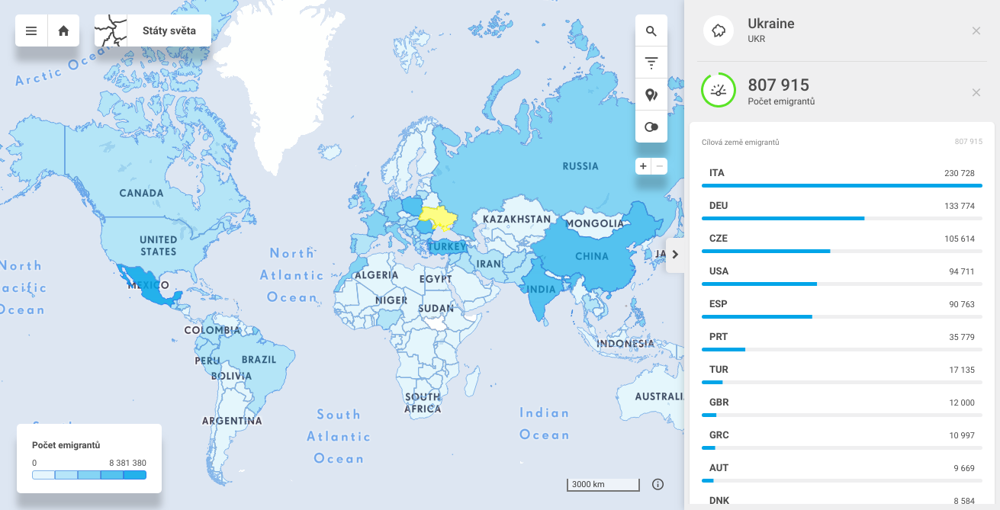
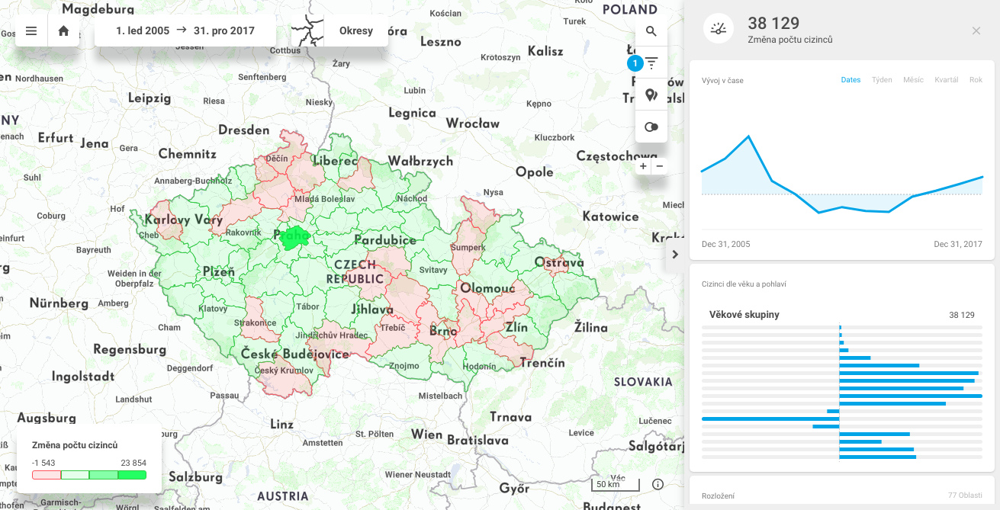
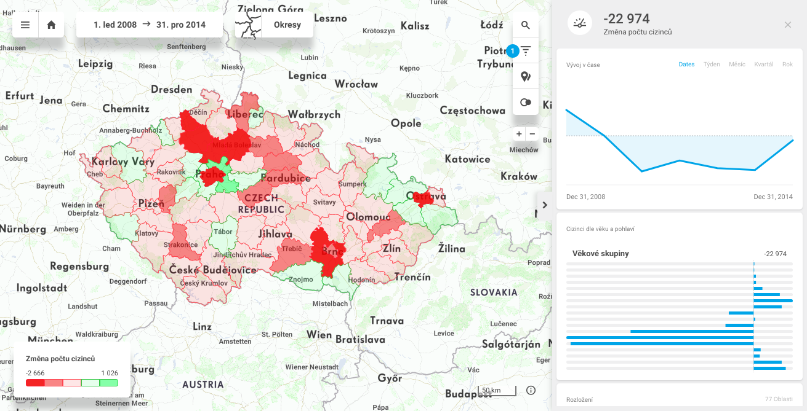
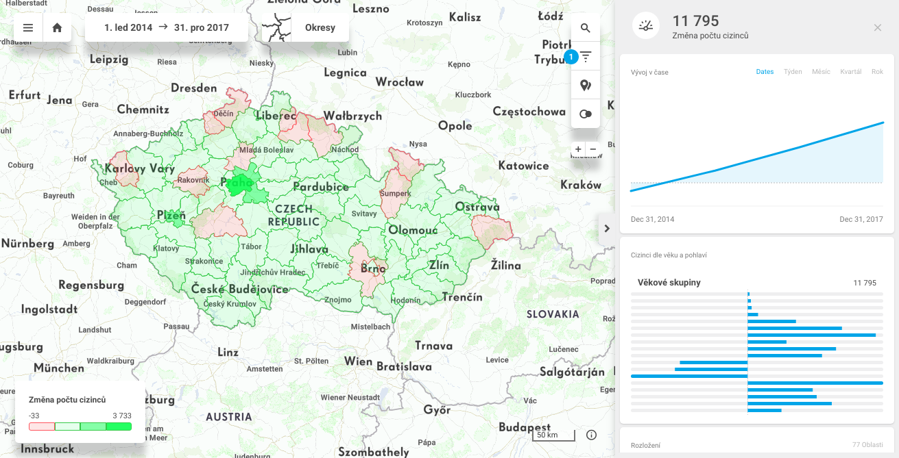

# Don't be ignorant about the world
Nastartováno bìhem akce HackujStat.cz 2018

* **Spoleèenský problém:** Vìdomí veøejnosti se èasto opírá o domnìnky a emoce vytvoøené nezøídka na základì senzaèních titulkù souèasných médií. Chybí komplexní a srozumitelná data pro veøejnost, která nejsou vytržena z dlouhodobìjšího kontextu a trendù.
* **Naše øešení:** Snaha zvýšit povìdomí o okolním svìtì na základì veøejnì dostupných dat a poskytnout reálné statistiky i data a doplnit je o pøehledné vizualizace.
* **Souèasný problém našeho øešení:** jak se dostat do povìdomí širší veøejnosti. :)

## Linky na aplikaci a kódy
* Aplikace pøístupná skrze https://secure.cleveranalytics.com/ui/#/go7u17ovdi3b9t4j/project (vyžaduje vytvoøit volný úèet a pøihlášení na CleverAnalytics platformì).
* Související GitHub repo https://github.com/zruzicka/HackujStat.cz_2018

## Popis projektu

Cílem projektu je zvýšit povìdomí o okolním svìtì na základì veøejnì dostupných dat a poskytnout reálné statistiky a data tam, kde se vìdomí veøejnosti opírá o domnìnky a emoce vytvoøené èasto na základì senzaèních titulkù souèasných médií. Hloubku problematiky nastiòuje video ["Hans and Ola Rosling: How not to be ignorant about the world"](https://www.ted.com/talks/hans_and_ola_rosling_how_not_to_be_ignorant_about_the_world?language=en) dostupné skrze TED platformu.

V souèasnosti jsme již dokázali mapovat a vizualizovat statistiky demografických ukazatelù cizincù v Èeské republice (téma migrace a imigrace ve veøejnosti vytváøí emoce, ale èasto chybí pøehlednì prezentovaná reálná data pro možnost vytváøení vlastního názoru a diskuze). Data cizincù v ÈR doplòujeme i tématikou migrace ve svìtovém mìøítku a èíslech.

Tématika "Don't be ignorant about the world" nám umožòuje ve svìtovém mìøítku dále hledat, mapovat a vizualizovat i další zajímavá otevøená data jako napø. statistiky gramotnosti, trend vývoje objemu turismu, vývoj humanitárních misí, trendy vývoje HDP, pøípadnì podíl HDP vìnovaný na sektor vzdìlání nebo zdravotnictví. Souèástí svìta jsou i neveselá témata jako množství pøírodních katastrof dle regionu, váleèné konflikty dle regionu nebo též poèty teroristických útokù dle data a regionu. Nabízí se také mapovat množství tìžby døeva dle regionu, produkce CO2 dle regionu nebo spotøeba pøírodních zdrojù dle regionu. Veøejnost má mít snadný pøístup k datùm i datovovým zdrojùm, která jsou pro ni zajímavá.

Velmi atraktivní by bylo postavit platformu takovým zpùsobem, aby umožòovala veøejnosti vytváøet/registrovat témata zájmu a též o nich hlastovat. Po získání dostateèného poètu zájemcù a souèasnì také po definování relevantní datové sady by probìhla integrace a zveøejnìní dat i vizualizace skrze naši platformu. Toto vytváøení a integrace nových témat mùže fungovat na osvìdèeném principu [Area 51, the Stack Exchange Q&A](http://area51.stackexchange.com/). Zpùsob a forma nastartování prezentace celého øešení široké veøejnosti je pøedmìtem souèasné diskuze. Nabízí se platformy jako Kickstarter, Patreon atd. nebo pøedstavení konceptu veøejnosti tøeba právì skrze Stack Exchange/Area 51. Cílem by ale mìlo být udìlat obsah platformy èasem natolik nezávislý, aby si ji mohly spravovat nadšenci a správci sami podobnì jako pøispívá veøejnost do obsahu Wikipedie.

V souèasnosti používáme k prezentaci dat platformu CleverAnalytics, která nám vyhovuje k prezentaci souèasných dat na úrovni jednotlivých státù ve svìtì nebo na úrovni jednotlivých okresù v ÈR (granularita na detailnìjší jednotky plochy je konfigurovatelná). Ale uvìdomujeme si, že máme-li integrovat otevøená data rùzného charakteru dohromady, potom mùžeme pøesáhnout i možnosti souèasné zvolené platformy a budeme hledat nová øešení.

## Popis pohledù v CleverAnalytics dashboard

### Analýza cizincù v ÈR
Prezentace demografických ukazatelù cizincù v Èeské republice. Využívá data Èeského statistického úøadu z let 2004-2017.
Konkrétnì se jedná o poèty cizincù s pobytem pøechodným, dlouhodobým, pobytem trvalým a dlouhodobým vízem v Èeské republice, ale vyjma azylantù. Jsou dostupná èlenìní podle pohlaví, pìtiletých vìkových skupin, státního obèanství cizince a podle okresù nebo krajù Èeské republiky.

### Analýza cizincù ve svìtì
Migraèní dataset vychází ze statistik oecd.org a zachycuje poèty migrantù z jednotlivých zemí svìta.

## Screenshoty z øešení
Následuje úkazka vizualizace napø. poètu migrantù v rùzném období 2006-2017 pro cizince s ukrajinským obèanstvím.

## Seznam dat/datových sad použitých v øešení
* https://www.czso.cz/csu/czso/cizinci-podle-statniho-obcanstvi-veku-a-pohlavi
* https://stats.oecd.org/Index.aspx?DataSetCode=MIG

## Seznam èlenù týmu
* [Martin Tesaø](https://github.com/mattesCZ)
* [Zbynìk Rùžièka](https://github.com/zruzicka)
* [Jindøich Mynarz](https://github.com/jindrichmynarz)
* Narcisa Kadleèáková

---

## Postup pøi øešení
* Seznámení s datovou sadou.
* Ovìøení, zda ÈSÚ tato data již nìkde prezentuje.
* Návrh zkoumaných pohledù, trendù a jevù.
* Validace a èištìní dat (csvclean).
* Transformace dat pro potøeby našeho datového modelu.
* Import dat do CleverAnalytics.
* Definice pohledù/views (v modelu CleverAnalytics).
* Definice modulù a poèetních metrik (v modelu CleverAnalytics).
* Analytika výstupních dat.
* Prezentace dat a výsledkù.

---

## Možnosti dalšího rozšíøení
### Krátkodobé mìøítko
* Pøidání pohledu se zamìøením na statistiky azylantù v ÈR v podobném èasovém rozmezí. (Jsme v kontatku s mentorem z ÈSÚ a po komunálních volbách 2018 má probíhat naše další komunikace ohlednì formátu)
* Pøidání statistik dat cizincù za rok 2018 - tyto data mají být k dispozici (dle informace z ÈSÚ) koncem èervna 2019.
* Rozšíøení view "Analýza cizincù ve svìtì" o statistiky také z pøedešlých let (= nikoliv prezentace dat pouze ze souèasnosti).
### Dlouhodobìjší mìøítko
* Umožnit lokalizaci obsahu pro èeskou i mezinárodní veøejnost.
* Zajímavou možností mùže být též hledání souvislostí ohlednì trendù migrace v návaznosti na ekonomické ukazatele (napø. navázání na statistiky z International Monetary Fund) nebo hledání souvislostí trendu migrace v návaznosti na politickou stabilitu.
* Dále možnost hledání a integrace dalších datasetù: statistiky gramotnosti, trend vývoje objemu turismu, vývoj humanitárních misí, trendy vývoje HDP, pøípadnì podíl HDP vìnovaný na sektor vzdìlání nebo zdravotnictví, množství pøírodních katastrof dle regionu, váleèné konflikty dle regionu nebo též poèty teroristických útokù dle data a regionu, množství tìžby døeva dle regionu, produkce CO2 dle regionu nebo spotøeba pøírodních zdrojù dle regionu.
* Další zajímavou možností je snažit se vytvoøit uživatelsky pøívìtivé rozhraní, které by v kontextu statistik migrace umožnilo nahlédnout na události, které byly pro zvolený region významné ve zvoleném èase. Jinými slovy, navázat se na globální archiv zpráv a mít možnost nad ním vykonávat pøíkazy jako 
`select * from [gdelt-bq:gdeltv2.events] where year=2014 and Actor1CountryCode='UKR' and sourceurl like '%ukraine%' LIMIT 20`
napøíklad skrze [GDELT 2.0 platformu](https://blog.gdeltproject.org/gdelt-2-0-our-global-world-in-realtime/) nebo skrze [GDELT 2.0 in Google BigQuery](https://bigquery.cloud.google.com/table/gdelt-bq:gdeltv2.events)
